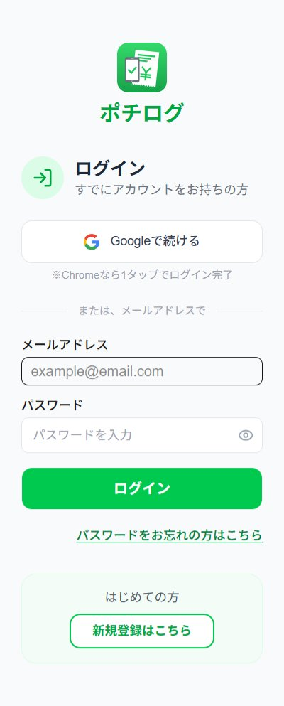
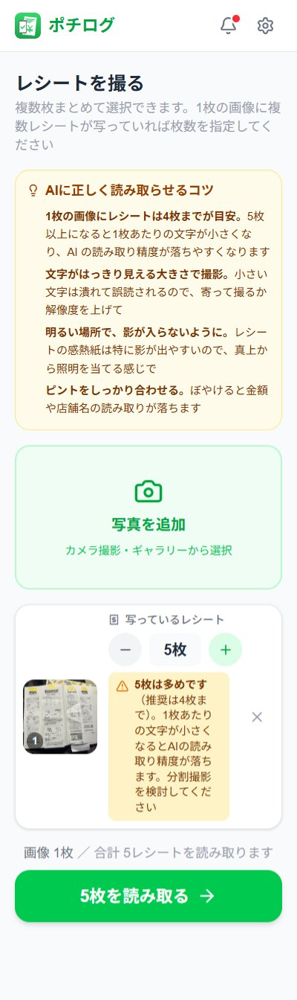
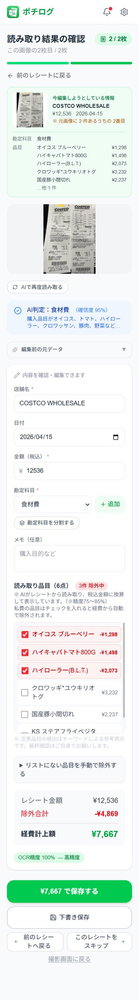
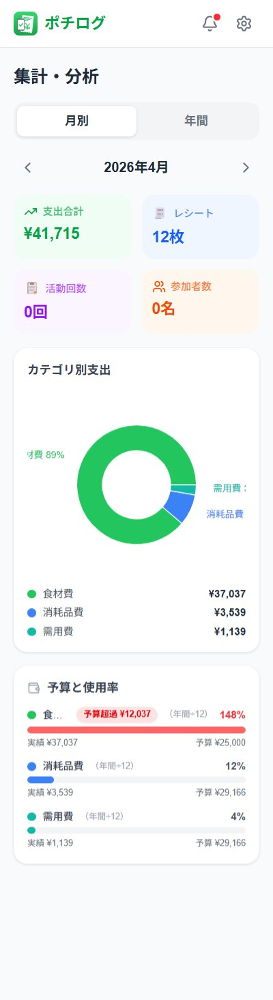
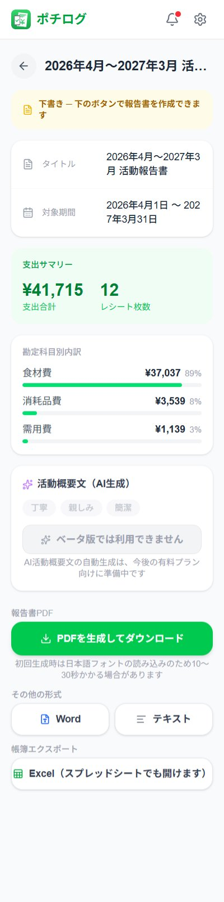

# ポチログ ─ 撮るだけ報告

> **レシートを撮影するだけで、助成金の年間報告書が自動生成される Web アプリ**

NPO・任意団体・個人事業主・ボランティア団体など、助成金を受給する団体の事務負担を減らすことを目的に開発しました。

- 🌐 **本番サービス：** [https://potilog.com](https://potilog.com)
- 📦 **このリポジトリについて：** ポチログのショーケース（紹介用）リポジトリです。**ソースコードは別の Private リポジトリで管理しており、本リポジトリにはコードは含まれません。**

---

## スクリーンショット

### 1. 始めるのは1タップ
Googleアカウントで即ログイン。

### 2. 全体像が一目でわかる
月次の支出と予算進捗をホームに集約。

### 3. 撮るだけ、複数枚も同時OK
1画像から複数レシート対応。

### 4. AIが「私費」を見抜く
経費に入れたくない品目を自動で除外。

### 5. どこに使ったか、グラフで丸わかり
カテゴリ別・予算別に可視化。

### 6. 報告書はワンクリック
PDF・Word・Excelで自動生成。

---

## サービス概要

レシートを撮るだけで、助成金事務に必要な作業が自動で進む Web アプリです。

- 📸 レシートを撮影 → OCR で日付・金額・店舗を自動抽出
- 🧠 AI が勘定科目を自動分類
- 📅 助成金年度（4 月〜翌 3 月）でリアルタイム集計
- 📄 PDF / Word / Excel 形式で年間報告書を自動生成
- 📝 活動記録・写真の管理、AI による活動概要文の下書き生成

### 想定ユーザー

- 助成金を受給する NPO・任意団体
- 助成金事務を担当する個人事業主・ボランティア団体
- 「経理・会計が本業ではない」団体運営者

---

## 技術スタック

| 領域 | 採用技術 |
|------|---------|
| フレームワーク | Next.js 16（App Router） |
| 言語 | TypeScript（strict モード） |
| スタイリング | Tailwind CSS v4 |
| UI ライブラリ | shadcn/ui |
| フォーム | React Hook Form + Zod |
| 状態管理 | Zustand |
| グラフ | Recharts |
| 認証・DB・ストレージ | Firebase（Auth / Firestore / Storage） |
| OCR・AI 分類・文章生成 | Google Gemini 2.5 Flash |
| PDF 生成 | @react-pdf/renderer |
| Word 生成 | docx |
| Excel 生成 | xlsx |
| エラー追跡 | Sentry |
| ホスティング | Vercel |
| テスト | Vitest（ユニット）/ Playwright（E2E） |

---

## 開発規模

| 項目 | 数値 |
|------|------|
| 開発開始 | 2026-04-11 |
| 現行バージョン | v1.10.1（本番稼働中） |
| ソースファイル数 | 163 ファイル（TypeScript / TSX） |
| コード行数 | 約 21,000 行 |
| コミット数 | 271 コミット |
| 主な開発フェーズ | Phase 1（MVP）／ Phase 2（品質向上）完了 |

> 個人開発として 1 名で設計・実装・運用まで担当しています。

---

## セキュリティ

第三者によるセキュリティ評価で **A 評価** を取得しています。

| 項目 | 内容 |
|------|------|
| 評価ツール | Security Headers（[securityheaders.com](https://securityheaders.com/)） |
| 評価結果 | **A 評価** |
| 取得日 | 2026-04-25 |

主な対策：

- HTTPS / HSTS 強制
- Content-Security-Policy（CSP）設定
- X-Frame-Options / X-Content-Type-Options 等のセキュリティヘッダー
- Firebase 認証＋ Firestore セキュリティルールによる多層防御
- 全 API ルート認証必須
- API キー等の機密情報はサーバーサイド環境変数で管理

---

## ソースコードについて

本リポジトリは **紹介・ショーケース用** で、ソースコード自体は含まれていません。

- ソースコードは **別の Private リポジトリ** で管理しています
- 顧客データ・運用設定・セキュリティ上の都合により、コードの一般公開は行っていません
- 採用・協業・技術検証等でコードレビューが必要な場合は、個別にご相談ください

---

## ライセンス

このリポジトリ（README・ドキュメント）は [MIT License](./LICENSE) のもとで公開しています。
本番サービス本体（ソースコード）はクローズドソースです。
